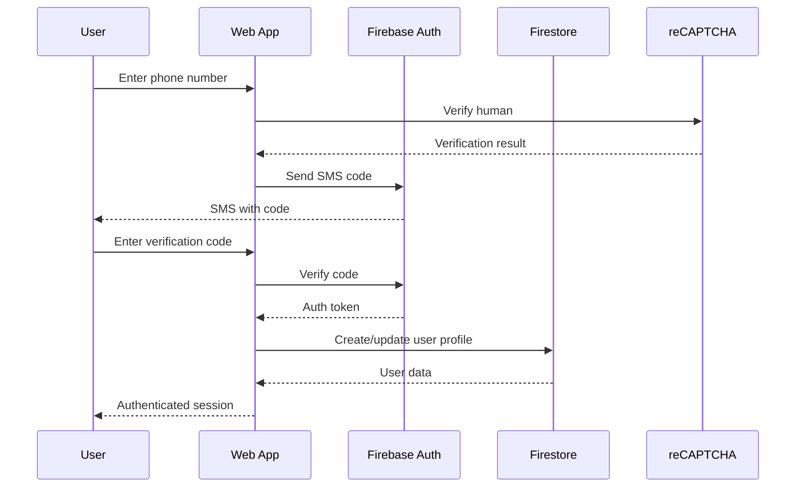
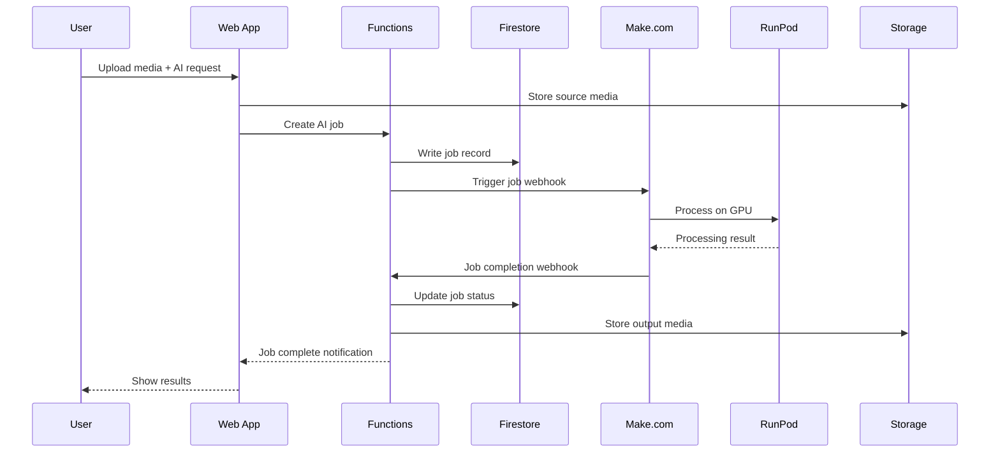
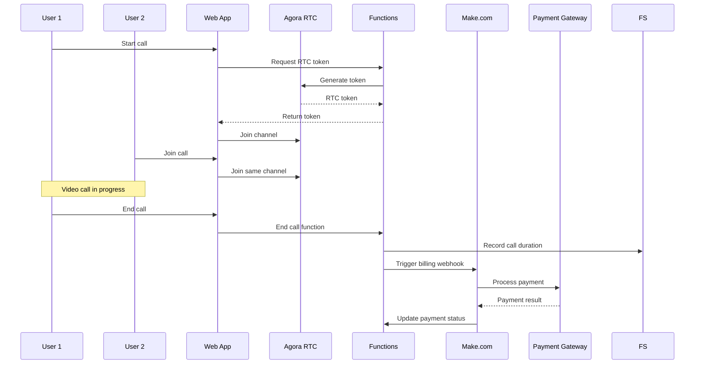
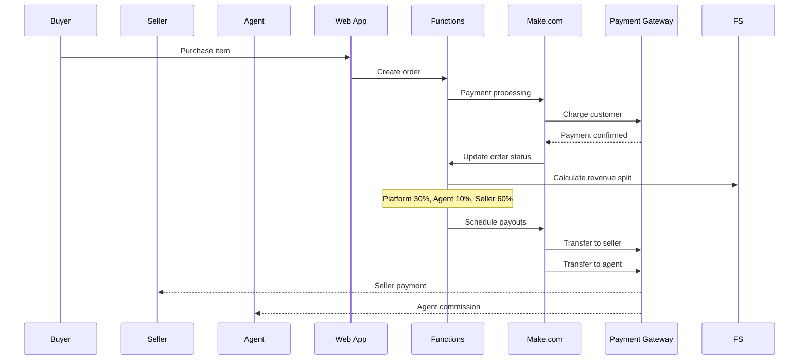
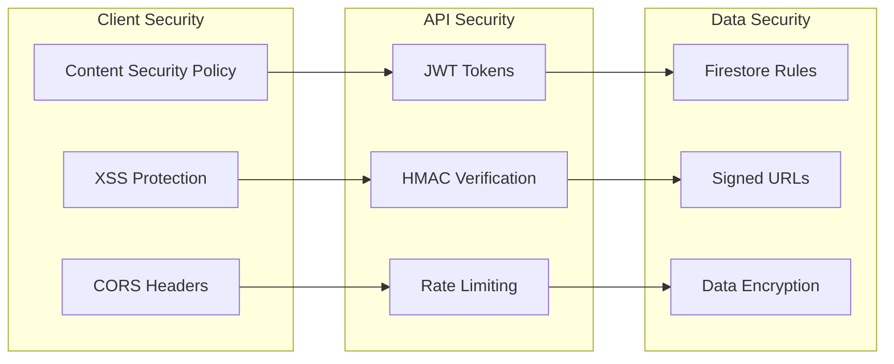

# AkiliPesa System Architecture

## High-Level Architecture

```mermaid
graph TB
    subgraph "Client Layer"
        WEB[Web App<br/>React + TypeScript]
        PWA[PWA Support<br/>Offline Capabilities]
    end

    subgraph "CDN & Hosting"
        FB_HOST[Firebase Hosting<br/>Global CDN]
        CF[Cloudflare<br/>DDoS Protection]
    end

    subgraph "Authentication & Security"
        FB_AUTH[Firebase Auth<br/>Phone + Google OAuth]
        RECAPTCHA[reCAPTCHA<br/>Bot Protection]
    end

    subgraph "Core Firebase Services"
        FIRESTORE[Firestore Database<br/>Real-time NoSQL]
        STORAGE[Firebase Storage<br/>Media Files]
        FUNCTIONS[Cloud Functions<br/>Serverless Backend]
    end

    subgraph "Real-Time Communication"
        AGORA[Agora.io RTC<br/>Video Calls]
        ZEGO[ZEGOCLOUD<br/>Alternative RTC]
    end

    subgraph "Orchestration Layer"
        MAKE[Make.com<br/>Workflow Automation]
        WEBHOOKS[Webhook Handlers<br/>Event Processing]
    end

    subgraph "AI Processing"
        RUNPOD[RunPod GPU Cluster<br/>AI Workloads]
        SD[Stable Diffusion<br/>Image Generation]
        VLLM[vLLM<br/>Chat Completion]
        WHISPER[Whisper<br/>Speech-to-Text]
        OPENVOICE[OpenVoice<br/>Text-to-Speech]
    end

    subgraph "AI Vendors (Optional)"
        OPENAI[OpenAI<br/>GPT-4 + Fallbacks]
        UDIO[Udio<br/>Music Generation]
        RUNWAY[Runway<br/>Video Effects]
        DEEPMOTION[DeepMotion<br/>Animation]
        SYNTHESIA[Synthesia<br/>AI Avatars]
        KAIBER[Kaiber<br/>Video Creation]
    end

    subgraph "Payment Processing"
        TIGO[TigoPesa<br/>Mobile Money]
        STRIPE[Stripe<br/>International Cards]
        MNO[Mobile Network<br/>Operators]
    end

    subgraph "Social Integration"
        INSTAGRAM[Instagram<br/>Auto-Post]
        TIKTOK[TikTok<br/>Auto-Post]
        YOUTUBE[YouTube<br/>Auto-Post]
        WHATSAPP[WhatsApp<br/>Sharing]
    end

    subgraph "Monitoring & Analytics"
        SENTRY[Sentry<br/>Error Tracking]
        ANALYTICS[Firebase Analytics<br/>User Behavior]
        DATADOG[DataDog<br/>Infrastructure]
    end

    %% Client connections
    WEB --> FB_HOST
    WEB --> FB_AUTH
    WEB --> FIRESTORE
    WEB --> STORAGE
    WEB --> AGORA
    WEB --> ZEGO

    %% Security layer
    WEB --> RECAPTCHA
    CF --> FB_HOST

    %% Core Firebase flow
    FB_AUTH --> FIRESTORE
    FUNCTIONS --> FIRESTORE
    FUNCTIONS --> STORAGE
    FUNCTIONS --> MAKE

    %% Orchestration flow
    MAKE --> RUNPOD
    MAKE --> TIGO
    MAKE --> STRIPE
    MAKE --> INSTAGRAM
    MAKE --> TIKTOK
    MAKE --> YOUTUBE

    %% AI processing flow
    FUNCTIONS --> RUNPOD
    RUNPOD --> SD
    RUNPOD --> VLLM
    RUNPOD --> WHISPER
    RUNPOD --> OPENVOICE

    %% Fallback connections
    FUNCTIONS --> OPENAI
    FUNCTIONS --> UDIO
    FUNCTIONS --> RUNWAY
    FUNCTIONS --> DEEPMOTION
    FUNCTIONS --> SYNTHESIA
    FUNCTIONS --> KAIBER

    %% Webhook returns
    MAKE --> WEBHOOKS
    TIGO --> WEBHOOKS
    STRIPE --> WEBHOOKS
    INSTAGRAM --> WEBHOOKS

    %% Monitoring
    WEB --> SENTRY
    WEB --> ANALYTICS
    FUNCTIONS --> SENTRY
    RUNPOD --> DATADOG

    classDef client fill:#e1f5fe
    classDef firebase fill:#fff3e0
    classDef ai fill:#f3e5f5
    classDef payment fill:#e8f5e8
    classDef social fill:#fce4ec
    classDef monitoring fill:#f9fbe7

    class WEB,PWA client
    class FB_HOST,FB_AUTH,FIRESTORE,STORAGE,FUNCTIONS firebase
    class RUNPOD,SD,VLLM,WHISPER,OPENVOICE,OPENAI,UDIO,RUNWAY,DEEPMOTION,SYNTHESIA,KAIBER ai
    class TIGO,STRIPE,MNO payment
    class INSTAGRAM,TIKTOK,YOUTUBE,WHATSAPP social
    class SENTRY,ANALYTICS,DATADOG monitoring
```

## Data Flow Diagrams

### 1. User Authentication Flow

### 2. AI Job Processing Flow

### 3. Video Call & Billing Flow

### 4. Commerce & Revenue Sharing

## Infrastructure Components

### Frontend (Web App)
- **Framework**: React 18 + TypeScript
- **Build Tool**: Vite
- **State Management**: Zustand
- **UI Components**: Custom + Lucide Icons
- **Styling**: Tailwind CSS
- **PWA Support**: Service Worker + Manifest

### Backend Services
- **Hosting**: Firebase Hosting (Global CDN)
- **Database**: Firestore (NoSQL, Real-time)
- **Storage**: Firebase Storage (Media files)
- **Functions**: Cloud Functions (Node.js 20)
- **Authentication**: Firebase Auth (Phone + OAuth)

### Third-Party Integrations
- **RTC**: Agora.io or ZEGOCLOUD
- **AI Processing**: RunPod GPU Cluster
- **Workflows**: Make.com automation
- **Payments**: TigoPesa, Stripe, Mobile Money
- **Security**: reCAPTCHA Enterprise
- **Monitoring**: Sentry, Firebase Analytics

## Security Architecture

### Authentication & Authorization

### Security Layers
1. **Client-Side**: CSP, XSS protection, secure cookies
2. **Transport**: HTTPS/TLS, certificate pinning
3. **API**: JWT authentication, HMAC verification, rate limiting
4. **Database**: Firestore security rules, field-level access
5. **Storage**: Signed URLs, time-limited access
6. **Functions**: Input validation, error handling, logging

## Scalability Considerations

### Horizontal Scaling
- **Frontend**: CDN distribution, edge caching
- **Backend**: Auto-scaling Cloud Functions
- **Database**: Firestore auto-scaling, regional replication
- **AI**: RunPod auto-scaling GPU clusters

### Performance Optimization
- **Code Splitting**: Lazy-loaded components
- **Asset Optimization**: WebP images, SVG icons
- **Caching**: Browser cache, CDN cache, API cache
- **Database**: Efficient queries, proper indexing

### Cost Optimization
- **Feature Flags**: Gradual rollout of expensive features
- **Resource Monitoring**: Track usage and costs
- **AI Fallbacks**: Use cheaper alternatives when possible
- **Efficient Queries**: Minimize database reads/writes

## Disaster Recovery

### Backup Strategy
- **Database**: Automated Firestore backups
- **Storage**: Cross-region replication
- **Code**: Git version control
- **Configuration**: Infrastructure as Code

### Recovery Procedures
- **RTO**: Recovery Time Objective < 4 hours
- **RPO**: Recovery Point Objective < 1 hour
- **Monitoring**: Health checks and alerting
- **Runbooks**: Documented recovery procedures

## Compliance & Privacy

### Data Protection
- **GDPR**: User consent, data portability, deletion
- **Local Laws**: Tanzania data protection compliance
- **Retention**: Automated data lifecycle management
- **Anonymization**: PII scrubbing for analytics

### Financial Compliance
- **PCI DSS**: Payment card security (via providers)
- **AML**: Anti-money laundering checks
- **KYC**: Know Your Customer verification
- **Audit Trail**: Transaction logging and reporting
